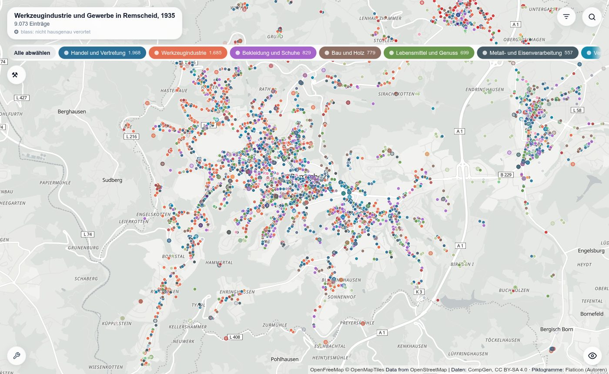
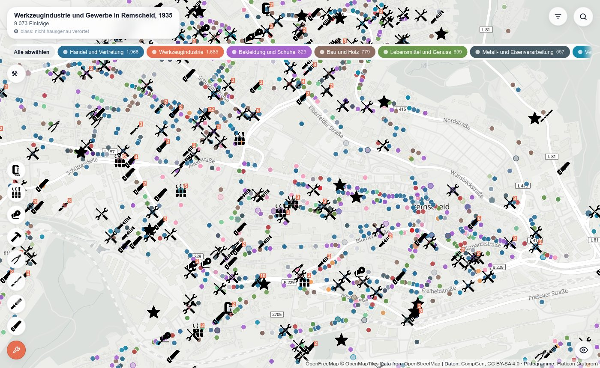

# Werkzeugindustrie und Gewerbe in Remscheid, 1935

Eine interaktive Karte der Remscheider Gewerbe aus dem Adressbuch von 1935,
und die Aufbereitung dahinter.

**Zur Karte: <https://rodouc6.github.io/werkzeugindustrie-gewerbe-remscheid-1935/>**



## Worum es geht

Das *Einwohner- und Geschäfts-Handbuch für Groß-Remscheid* von 1935 verzeichnet
Einwohner, Behörden, Straßen und Gewerbe der Stadt. Freiwillige des Vereins für
Computergenealogie (CompGen) haben die 718 Seiten vollständig abgeschrieben; der
Verein hat die Erfassung 2021 für den Kultur-Hackathon *Coding da Vinci
Nieder.Rhein.Land* als offene Daten bereitgestellt. Dieses Projekt nimmt das
**Gewerbeverzeichnis** daraus, verortet jeden Eintrag auf einer heutigen Karte
und ordnet ihn einer Branche zu:

- **9 361 Einträge** im Gewerbeverzeichnis, davon **9 073 auf der Karte**
- **924 verschiedene Branchenbezeichnungen**, so wie die Quelle sie führt,
  zusammengefasst zu **17 Kategorien**
- **Werkzeugindustrie** als Schwerpunkt: 1 685 Einträge, auf
  Wunsch als Piktogramme (Säge, Feile, Zange, Hammer, …) dargestellt

Auf der Karte lassen sich Kategorien ein- und ausblenden, Firmen und Inhaber
suchen und die Werkzeugbetriebe gesondert zeigen.



## Vom Adressbuch zur Karte

```
  Adressbuch Remscheid 1935 (gedruckt)
        │
        │  Erfassung durch CompGen-Freiwillige,      ┐  vorgelagert,
        │  bereitgestellt über Coding da Vinci 2021   ┘  nicht Teil dieses Projekts
        ▼
  data/remscheidABNRW1935.csv   (ein Eintrag je Zeile, unverändert)
        │
        │  01  Gewerbe- und Einwohnerverzeichnis auswählen,
        │      Adressen vereinfachen    ◄── data/strassen_mapping.csv
        │  02  verorten über Nominatim (OpenStreetMap)
        │  03  Genauigkeit jedes Treffers bewerten
        │  03b Einträge derselben Firma erkennen    ──►  data/firmen_abgleich.csv
        │      (in Arbeit, fließt noch nicht in die Karte ein)
        │  04  Branche per Stichwortregeln vorschlagen  ──►  data/branchen_mapping.csv
        │  05  Branche per Sprachmodell prüfen          ──►  (dieselbe Datei)
        │  06  Kartendaten schreiben
        │  07  Werkzeugfirmen zusammenfassen, Piktogramme zuordnen
        ▼
  docs/   Website: Karte mit Filter und Suche
```

1. **Adressen vereinfachen.** Doppelte Hausnummern werden auf die erste
   verkürzt (`78/80` → `78`), Eckangaben entfallen. Straßen, die seit 1935
   umbenannt wurden, werden auf den heutigen Namen gesetzt, etwa die
   Adolf-Hitler-Straße auf die Alleestraße. Die 35 Regeln dafür stehen mit
   Begründung in `data/strassen_mapping.csv`.
2. **Verorten.** Jede Adresse wurde gegen eine lokale Nominatim-Instanz mit
   heutigen OpenStreetMap-Daten abgefragt.
3. **Branchen zuordnen.** Die erste Branchenangabe nach dem Firmennamen wird
   zuerst über Stichwortregeln, dann über ein Sprachmodell (Mistral Small über
   KI:connect.nrw) einer Kategorie zugeordnet. Beide Vorschläge und die
   Begründung des Modells bleiben in `data/branchen_mapping.csv` nachlesbar.
   Zeilen mit `quelle = manuell` überschreibt kein Skript.
4. **Zeigen.** Die Website ist statisch: HTML, CSS und JavaScript mit
   MapLibre, Grundkarte von OpenFreeMap, ohne Server und ohne Datenbank.

Die Skripte, ihre Ein- und Ausgaben und der Ablauf im Einzelnen stehen in
[`src/README.md`](src/README.md).

## Grenzen der Daten

- **Heutige Karte, historische Adressen.** Remscheid wurde 1943 schwer
  zerstört, Straßen wurden umbenannt und Häuser neu nummeriert. Auch ein
  „hausgenauer“ Treffer zeigt das heutige Haus mit dieser Nummer, nicht
  zwingend das von 1935.
- **Verortung.** Von den 9 073 Einträgen auf der Karte sind 7 282 hausgenau
  verortet, 1 674 nur auf die Straße und 117 nur ungefähr (Ortsteil oder
  Hofschaft). Die ungenauen Punkte sind auf der Karte blass mit farbigem Ring
  gezeichnet; mehrere Einträge derselben Straße liegen dann übereinander.
  288 Einträge ließen sich nicht verorten.
- **Branchen sind Zuordnungen, keine Quellenangaben.** Die Kategorien stammen
  aus diesem Projekt, nicht aus dem Adressbuch. 52 Branchenbezeichnungen sind
  noch als „prüfen“ markiert, 203 Einträge blieben ohne Kategorie.
- **Einträge, nicht Firmen.** Das Gewerbeverzeichnis ist nach Branchen
  geordnet und führt eine Firma unter jeder ihrer Branchen erneut, oft in
  anderer Schreibweise. Die Karte zeigt jeden Eintrag als eigenen Punkt; hinter
  den 9 073 Punkten stehen nach vorläufigem Abgleich rund 7 200 Firmen. Das
  Zusammenführen ist aufwendig, weil an einer Adresse oft mehrere Generationen
  derselben Familie ein Gewerbe führten und die Abschrift viele
  Schreibvarianten enthält. Schritt 03b bereitet es vor; die Prüfung von Hand
  steht noch aus.
- **Ein Werkzeug-Symbol je Adresse.** Sitzen mehrere Werkzeugfirmen an einer
  Adresse, zeigt die Karte nur ein Symbol und die übrigen Firmen in dessen
  Liste. Der Filter nach Werkzeugart prüft bisher nur dieses eine Symbol;
  Firmen dahinter findet er nicht.
- **Nur das Gewerbeverzeichnis.** Das Einwohnerverzeichnis (43 017 Einträge)
  wird mit verortet, erscheint aber nicht auf der Karte.
- **Die Bezeichnungen stammen aus der Quelle.** Straßennamen der NS-Zeit
  stehen in den Einträgen so, wie sie 1935 gedruckt wurden.

## Aufbau des Repositorys

```
docs/          Website (GitHub Pages): index.html, app.js, app.css, Kartendaten
data/          Quelle und die von Hand gepflegten Zuordnungen
src/           Aufbereitung in sieben Schritten (Python)
tests/         Tests der Aufbereitung: python3 -m unittest discover tests
```

Zwischenergebnisse landen in `output/` und sind nicht im Repository; sie
lassen sich aus `data/` und `src/` neu erzeugen.

## Quelle, Lizenz, Kontakt

**Quelle:** Einwohner- und Geschäfts-Handbuch für Groß-Remscheid: Remscheid –
Lennep – Lüttringhausen, Remscheid: Ziegler 1935
([Digitalisat](https://www.digibib.genealogy.net/viewer/image/871718278D_1935/1/-/),
[GenWiki](https://wiki.genealogy.net/Remscheid/Adressbuch_1935)).
Daten: Verein für Computergenealogie e.V., *Historische Adressbücher aus dem
Rheinland und Ruhrgebiet*, bereitgestellt für Coding da Vinci Nieder.Rhein.Land
2021 ([Datensatzseite im Archiv](https://web.archive.org/web/20210906074729/https://codingdavinci.de/daten/historische-adressbuecher-aus-dem-rheinland-und-ruhrgebiet),
[Download](https://download.codingdavinci.de/s/c8zc6Bn4dZMzyFS)),
Lizenz [CC BY-SA 4.0](https://creativecommons.org/licenses/by-sa/4.0/deed.de).

**Lizenz:** Der Code steht unter der MIT-Lizenz. Die Daten, also die Quelldatei
und alles, was dieses Projekt daraus erzeugt (Koordinaten, Genauigkeit,
Straßen- und Branchenzuordnung, Kartendaten), stehen wie die Quelle unter
CC BY-SA 4.0. Die Werkzeug-Piktogramme haben eigene Bildnachweise. Näheres in
[`LICENSE`](LICENSE) und [`LICENSE-DATEN.md`](LICENSE-DATEN.md).

**Kontakt:** Christos Rodouniklis, Bergische Universität Wuppertal.
